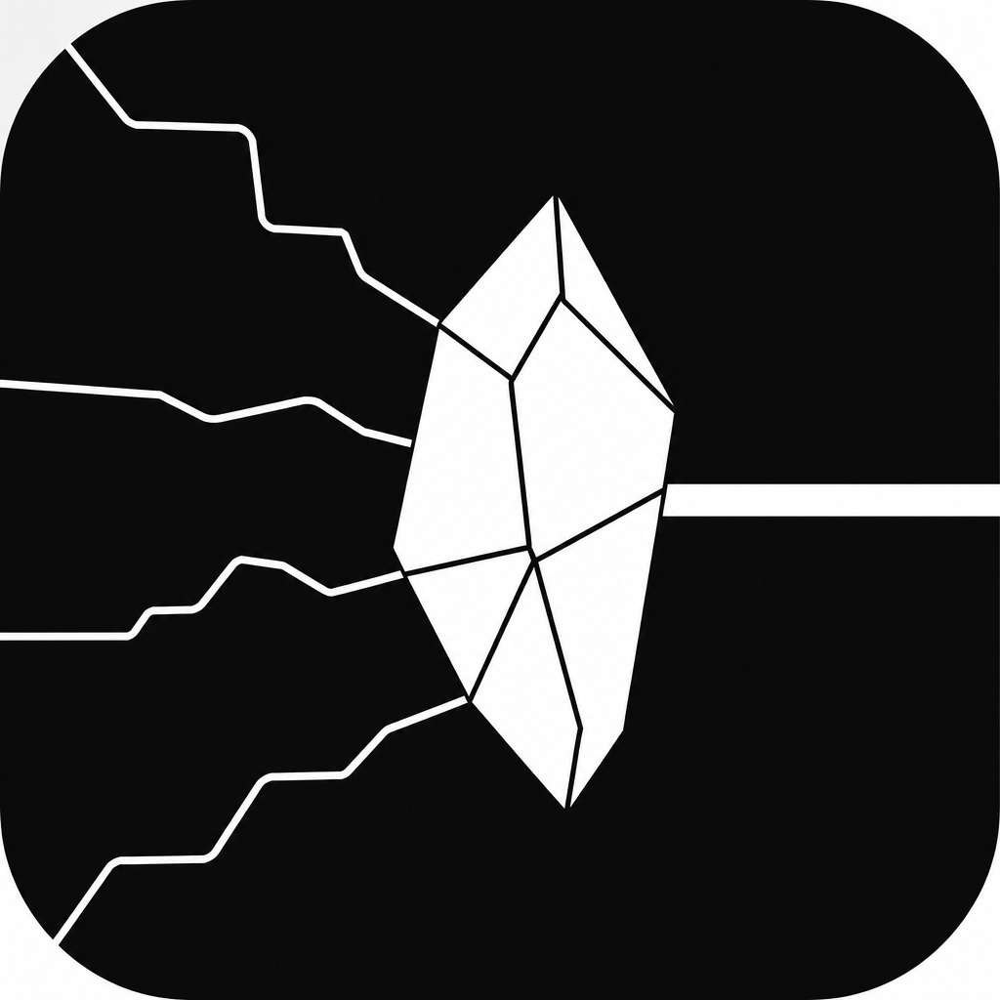

<p align="center">
  
</p>

<h1 align="center">Prism</h1>

<p align="center">
  <strong>Only variety can absorb variety.</strong><br />
  — W. Ross Ashby
</p>

A no-code **mixture-of-agents (MoA) laboratory**: compose multi-agent workflows as a living graph — context in upstream, specialists and models on each branch, step or run the system, inspect every bifurcation’s artifacts and metrics.

Prism harnesses complexity by giving the system enough structured variety — roles, models, paths — to steer hard problems, not by collapsing everything into one linear chat.

## Status

**Ships today:** graph shell with **Add tile** / **Delete** / rewire (incl. late context inject), select → **Expand** node workspace (Label / Role / **Steer** / Prompt / model), output reading page, architectures (save / template / export), connections + provider verify, docs, publish-package **schema**.

**Next (Block 3):** Step / Run all — execute the pathway, fill outputs and metrics, compose Steer into provider calls.

This is an early lab release. Expect sharp edges; issues and PRs welcome.

## Quickstart

```bash
git clone https://github.com/0xalphaprime/prism.git
cd prism
cp .env.example .env.local   # add your provider keys
npm install
npm run dev
```

Open **[http://localhost:3001](http://localhost:3001)** (Prism uses port **3001**, not 3000).

If you open it over Tailscale (e.g. `http://100.111.89.59:3001`), that host must be in `allowedDevOrigins` in `next.config.ts` or Next 16 blocks `/_next` chunks — you’ll see the chrome with an empty canvas. Add other LAN/Tailscale hosts via `PRISM_DEV_ORIGINS` (comma-separated). IDs work over plain HTTP (no `crypto.randomUUID` secure-context requirement).

Provider keys stay in `.env.local` (never commit real keys). `.env*` is gitignored; [`.env.example`](.env.example) lists the empty placeholders.

```bash
# verify providers
curl 'http://localhost:3001/api/providers?probe=1'
```

In the app: **Connections → Verify providers** flips cards to Connected when a key works.

## Docs

- **[Brand lock](docs/BRAND.md)** — Ashby tagline (canonical)
- **[Product guide (v1)](docs/GUIDE.md)** — node kinds, Label / Role / Steer / Prompt, pipeline, research mapping
- **[Variety toolkit](docs/VARIETY.md)** — Ashby-guided attributes & roadmap brainstorm
- **[Publish package schema](docs/PUBLISH.md)** — portable architecture + sample runs for gallery / fork
- **[Research notes](RESEARCH.md)** — MoA lineage and orchestration stack

## What you can do now

1. Load the starter MoA template (on the canvas)
2. Place context channels → attach payloads in **Context**
3. Set architecture **Prompt** (run intent)
4. Tune **Role**, **Steer**, **Model**, and node **Prompt** on Split / agents / Judge
5. **Log checkpoint** to start run history
6. Try talk: `add a summarizer before the judge`

## Stack

- Next.js + React + TypeScript
- React Flow (`@xyflow/react`)
- Zustand

## North star

The unit of expression is an **architecture** people can build, share, and fork — not a chat transcript. Longer term: a gallery / marketplace of pathways (research, science, product, …), with optional tiny attribution when a published template is used on hosted runs. **Not in this release** — first we make a tool people want to use.

## License

[MIT](LICENSE) — Copyright (c) 2026 0xalphaprime.

## Contributing

Issues and pull requests are welcome. Please:

- Do **not** paste API keys, tokens, or `.env.local` contents into issues or PRs
- Keep changes focused; match existing UI and docs vocabulary (Context Hub, Split, Steer, …)
- Prefer a short description of *why* in the PR body

You keep copyright on your contributions under the same MIT terms unless we agree otherwise.
