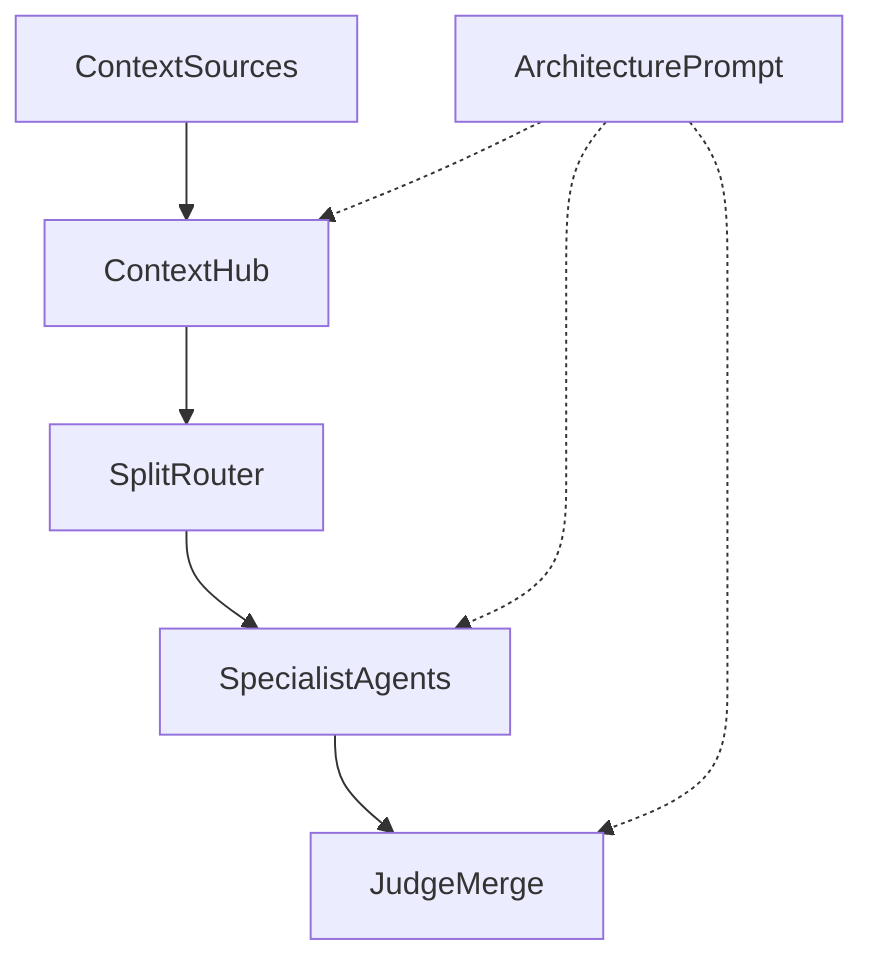

# Prism — Product Guide (v1)

**Audience.** Builders using Prism as a mixture-of-agents (MoA) laboratory.  
**Companion.** Deep paper notes live in [`RESEARCH.md`](../RESEARCH.md). This guide is product-first.  
**Tagline.** *Only variety can absorb variety.* — W. Ross Ashby  
**Last updated.** 2026-08-09

---

## 1. What Prism is

**Only variety can absorb variety.** (Ashby) Prism is the lab that *acts* on that law: enough structured variety in the graph — roles, models, steers, paths — to absorb problem complexity, without dumping it into one opaque chat.

Prism is a visual, no-code **MoA laboratory**. You compose multi-agent pathways as a living graph: bring context in upstream, assign specialists and models to each branch, define variables at every step, then step or run through the system and inspect what each node produces.

The real objective is not a black-box chat. It is to **produce inspectable data and outputs along the way** — sequential, incremental work you can version, compare, and refine.

The canvas is there so someone can *see*:

- how a mixture-of-agents architecture is shaped
- how work moves through the full pipeline
- what artifacts appear at each bifurcation
- which variables are set at each step
- eventually, how many parallel instances of the same pathway behave under a sweep

**Lab thesis** *(from research)*: diverse proposers + a strong synthesizer beat a single model; then sparsify *messages*, then *activation*, then *topology*; always wire it as an **explicit, inspectable graph** — not free-form multi-agent chat. See [`RESEARCH.md`](../RESEARCH.md).

---

## 2. Mental model



**Spine today**

1. **Context sources** — channel tiles (Browser, Documents, Knowledge, Skills, …)
2. **Context Hub** — merges carried attachments into one upstream stream
3. **Split** — router that fans work into specialist lanes
4. **Agents** — proposers / specialists (Researcher, Writer, Critic, …)
5. **Judge** — merge / aggregator that synthesizes branch outputs

Around the graph:

| Surface | Job |
|---------|-----|
| **Add tile** | Place Agent / Split / Judge / Context Hub / context channels |
| **Select → Expand** | Full node workspace: Label, Role, Steer, Model, Prompt, **Controls** (budget, sampling, tools, schema, forward, rubric, publish), metrics |
| **Open output** | Full-page artifact view for that node |
| **Drag handles** | Rewire edges (Hub is default; late inject allowed) |
| **Delete** | Remove selected tile (+ edges); last Context Hub protected |
| **Prompt** (`/prompt`) | Architecture-level *run intent* for the whole pathway |
| **Context** (`/context`) | Attach and manage payloads for each channel |
| **Connections** (`/connections`) | Provider / API / feed readiness |
| **Runs** | Checkpoints and history (execution fills results in Block 3) |
| **Talk** | Natural-language edits that land on the same graph |

**Topology note.** Channels default into **Context Hub**, then Split → agents → Judge. You may also drag a channel (or Hub) **directly into a downstream node** for intentional late context inject. See [`VARIETY.md`](VARIETY.md) for the toolkit roadmap.

---

## 3. Key definitions

These terms are locked vocabulary for the lab. Use them consistently in UI, docs, and experiments.

| Term | Meaning in Prism |
|------|------------------|
| **Kind (type)** | Structural job of the node on the graph: `context-source`, `context`, `router`, `agent`, `merge` |
| **Label** | Human-facing name on the tile and in the inspector (e.g. *Researcher*, *Split*). Identity for humans — **does not change behavior by itself** |
| **Role** | Functional assignment — what this node is *for* in the pathway (proposer, critic, aggregator, fan-out) |
| **Steer** | Proximal guidance that shapes *how* the prompt is applied against upstream context. Short, local, opinionated |
| **Prompt** (node) | Task instruction for an agent or judge at execution time |
| **Prompt** (architecture) | Global run intent for the whole pathway (`/prompt`) |
| **Model** | Bound inference target as `provider:model` (agents and merge) |
| **Output** | Text artifact produced by a node after a step or run |
| **Metrics** | Latency, tokens, estimated cost for that node’s work |
| **Architecture** | A saved Prism document: graph + meta + attachments + runs |
| **Attached context** | Library items carried from channel tiles through the Hub into the stream |

### Kind ↔ fields

| Kind | UI name | Fields that matter | Produces |
|------|---------|--------------------|----------|
| `context-source` | Channel tile (Browser, Documents, …) | Label; attachments via Context workspace | Context count / payloads |
| `context` | **Context Hub** | Label; hub notes | Merged upstream stream |
| `router` | **Split** | Label, **Role**, **Steer**, forward (keep-k / stop), publish | Fan-out into specialist lanes |
| `agent` | Specialist (Researcher, Writer, …) | Label, **Role**, **Steer**, Model, Prompt, budget, sampling, tools, schema, rubric, publish | Output + metrics |
| `merge` | **Judge** | Label, **Role**, **Steer**, Model, Prompt, + same Controls as agent, plus forward | Synthesized output + metrics |

**Inputs.** Upstream edges define what a node can see — there is no separate input-map editor. **Controls** store run policy for Block 3; they do not execute until then.

**Label vs Role vs Steer vs Prompt**

| Field | Answers | Example |
|-------|---------|---------|
| Label | What do we call this tile? | `Critic` |
| Role | What job does it play in the MoA? | `Pressure-test clarity and differentiation` |
| Steer | How should that job behave *against this context*? | `Attack mushy claims; protect what must stay distinct.` |
| Prompt | What exact task should it do this run? | `Critique the product idea for mushy positioning…` |

---

## 4. How to write Steer

Steer is **proximal**: it sits next to the node’s Role and Prompt and nudges execution without replacing either.

### Recipe

1. **One or two sentences.** Constraints over essays.
2. **Prefer / avoid shape.** “Prefer named products. Avoid category fluff.”
3. **Local to this node.** Don’t restate the architecture Prompt; don’t rewrite the Role.
4. **Testable.** Someone else should know if the output obeyed the steer.

### Good examples (starter pathway)

| Node | Steer |
|------|-------|
| Split | Keep lanes distinct; don’t collapse the brief into one generic ask. |
| Researcher | Name real products and concrete gaps — skip vague category talk. |
| Writer | Demo-ready voice; short, sharp, no fluff. |
| Critic | Attack mushy claims; protect what must stay distinct. |
| Judge | One crisp recommendation beats a laundry list. |

### Anti-patterns

- Restating the Role in different words
- Novel-length policy dumps
- Empty Steer + vague Prompt (no local control surface)
- Putting global run intent only in Steer (that belongs in architecture **Prompt**)

### Composition at run time (Block 3)

When Step / Run all land, each downstream call should compose roughly:

```
architecture Prompt  (run intent)
+ upstream context   (Hub stream / prior outputs)
+ Role
+ Steer              (proximal)
+ node Prompt        (task)
```

Steer is the dial for *how* that node behaves on *this* pathway without rewriting the whole task.

---

## 5. Variables at each step

Treat the UI as an experiment control panel. Every knob below is a variable you can version.

### Architecture-level

- Name, description, tags
- Run-intent **Prompt**
- Connections (providers / feeds)
- Context catalog (which channels exist)
- Attached context payloads

### Per-node

| Variable | Where |
|----------|--------|
| Label | Inspector |
| Role | Inspector (router, agent, merge) |
| Steer | Inspector (router, agent, merge) |
| Model | Inspector (agent, merge) |
| Prompt | Inspector (agent, merge) |
| Hub notes | Context Hub / context workspace |

### Observed (after execution)

- Output text
- Latency, tokens in/out, estimated cost
- Run checkpoints (**Log checkpoint** today; full results in Block 3)

**Practice:** when you change variables that matter, **Save**, **Duplicate**, or **Export** the architecture so pathways stay comparable. Checkpoints without topology/prompt snapshots are hard to trust later.

---

## 6. Research ↔ methodologies in this lab

Prism is the visualization and control surface for patterns documented in [`RESEARCH.md`](../RESEARCH.md).

| Methodology | Idea | Prism shape today / next |
|-------------|------|---------------------------|
| **Classic MoA** | Diverse proposers + strong synthesizer; re-inject user intent | Hub → Split → diverse agents → Judge |
| **SMoA** | Roles + keep top‑*k* messages + moderator depth | Distinct Role/Steer; Expand **forward** (keepK / stop / maxRounds) — enforced in Block 3 |
| **RouteMoA** | Sparse *activation* — choose who runs before paying inference | Split evolves into a budgeted router over a model pool |
| **Faster-MoA** | Sparse topology + serving co-design | Later: tree-ish graphs, early exit |
| **Fan-out / fan-in** (Ganji) | Decompose → parallel → synthesize | Starter MoA template |
| **Debate / refine** | Opposing specialists or critic loops | Parallel debate template; refine cycles later |
| **Durable runs + observability** | Checkpoints, traces, $/agent | Runs panel → Block 3 traces and metrics |

### What we are optimizing for in the lab

```
QUALITY     →  MoA collab + role diversity + synthesize
MESSAGES    →  SMoA-style keep-k (future)
ACTIVATION  →  RouteMoA-style who wakes (future)
TOPOLOGY    →  lean graphs, not all-to-all
RUNTIME     →  explicit graph state, inspectable artifacts
```

---

## 7. Working the pipeline

Recommended first path:

1. **Add tile** — place agents, Split, Judge, and/or context channels; wire with drag handles.
2. **Attach payloads** in **Context** (`/context`) — footers show `Context (N)`.
3. Set the architecture **Prompt** (`/prompt`) — the run intent.
4. **Select** a tile → **Expand** (or double-click); fill **Label**, **Role**, **Steer**, **Model**, **Prompt**, and **Controls** as needed. **Open output** for artifacts. **Delete** tiles you no longer want.
5. **Clean layout** if tiles overlap; **Save architecture**.
6. **Log checkpoint** to start run history even before full execution.
7. **Step / Run all** (Block 3) — then open outputs per node; compare in **Runs**.
8. **Duplicate** the architecture to A/B a variable (model, steer, context set) without losing the prior pathway.

Talk bar examples that mutate the same graph: `add a summarizer before the judge`, `use the cheaper model on research`.

---

## 8. Publish package (schema sketch)

The public-good unit is a **publish package**: architecture + context *recipe* + 1–3 sample runs + listing metadata.  
See [`docs/PUBLISH.md`](PUBLISH.md) and [`src/lib/publish.ts`](../src/lib/publish.ts).

Fork → fill context slots → re-run → compare. Hosted runs (later) can debit a simple account balance; the publish package itself stays graph + proof artifacts.

## 9. Roadmap (honest)

| Horizon | What ships |
|---------|------------|
| **Now** | Graph chrome, compact context tiles, Context / Prompt / Connections pages, Role + **Steer**, architectures, checkpoints, publish schema sketch |
| **Next (Block 3)** | Step / Run all; fill Output + Metrics; compose Steer into provider calls; richer run records; export publish package |
| **Later** | Gallery / fork; keep‑*k* and routing policies; optional account balance for hosted inference; **many parallel instances** of one pathway for extreme sweeps |

The extreme end-state: define a pathway once, fan many instances with controlled variable grids, and harvest sequential artifacts across the swarm — still inspectable node by node.

---

## 10. Anti-patterns

- Calling the same model *n* times and labeling it “diversity”
- Dense all-to-all graphs “just add more agents”
- Empty Steer + mushy Prompt
- Context only in chat memory with nothing attached on the Hub
- Changing models/steers without Save / Duplicate / checkpoint
- Rank-only fusion with no synthesizer (MoA literature favors synthesize over pick-best)
- Treating Prism as a single chat transcript instead of a pathway of artifacts

---

## 11. Quick reference — UI names

| In the app | In this guide |
|------------|---------------|
| Context Hub | `context` kind |
| Split | `router` kind |
| Researcher / Writer / Critic / … | `agent` kind |
| Judge | `merge` kind |
| Context (N) footer | Attachments for that channel / hub |
| Prompt (architecture bar) | Architecture run intent |
| Clean layout | Re-spread vertical MoA spine |
| Log checkpoint | Run history stub |
| More → Template / Export / … | Architecture library ops |

---

*End of v1 guide. Patch when Block 3 or methodology presets change the product surface.*
