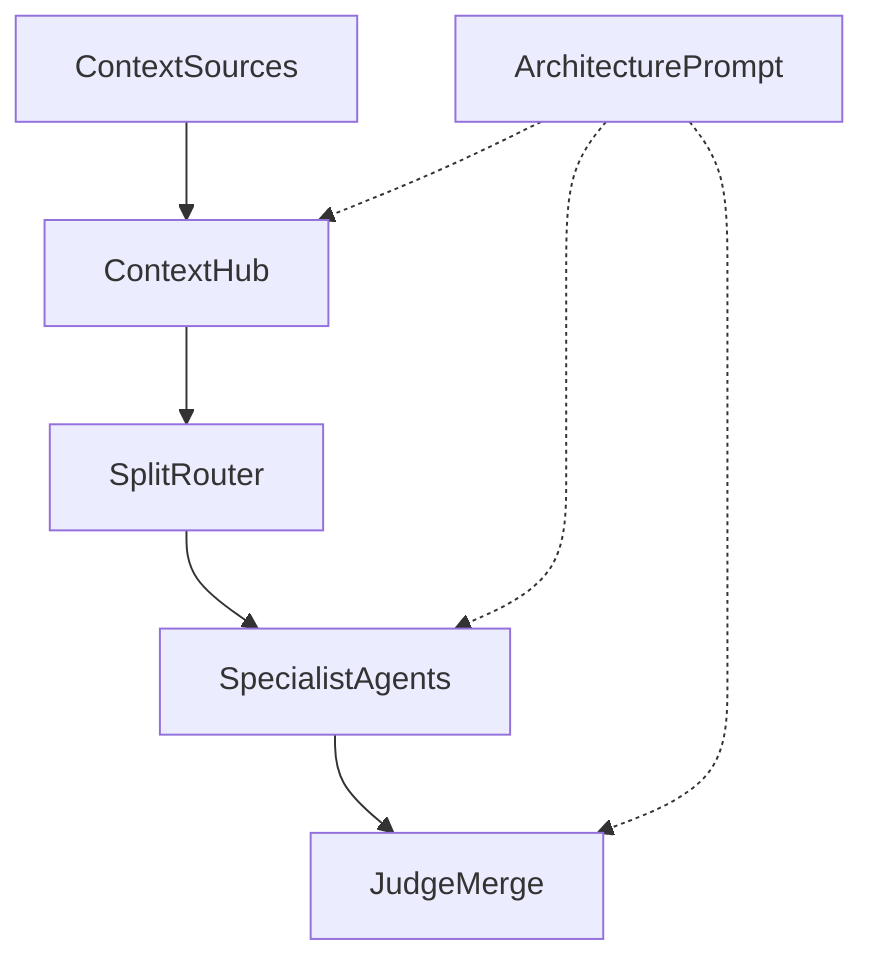

# Prism — Product Guide (v1)

**Audience.** Builders using Prism as a mixture-of-agents (MoA) laboratory.  
**Companion.** Deep paper notes live in [`RESEARCH.md`](../RESEARCH.md). This guide is product-first.  
**Tagline.** *Only variety can absorb variety.* — W. Ross Ashby  
**Last updated.** 2026-08-22

---

## 1. What Prism is

**Only variety can absorb variety.** (Ashby) Prism is the lab that *acts* on that law: enough structured variety in the graph — roles, models, steers, paths — to absorb problem complexity, without dumping it into one opaque chat.

Prism is a visual, no-code **MoA laboratory**. You compose multi-agent pathways as a living graph: bring context in upstream, assign specialists and models to each branch, define variables at every step, then step or run through the system and inspect what each node produces.

The real objective is not a black-box chat. It is to **produce inspectable data and outputs along the way** — sequential, incremental work you can version, compare, and refine. The **graph** is how you compose the pathway. **Trace** (`/trace`) is the early product surface: how you **read the run as an MoA report** (spine, who each hop saw, cells in graph order) and how you **hand the run to another agent or a training loop** (report / attribution pack / causal JSONL). Prism does not train.

The canvas is there so someone can *see*:

- how a mixture-of-agents architecture is shaped
- how work moves through the full pipeline
- what artifacts appear at each bifurcation
- which variables are set at each step
- eventually, how many parallel instances of the same pathway behave under a sweep

**Lab thesis** *(from research)*: diverse proposers + a strong synthesizer beat a single model; then sparsify *messages*, then *activation*, then *topology*; always wire it as an **explicit, inspectable graph** — not free-form multi-agent chat. See [`RESEARCH.md`](../RESEARCH.md).

---

## 2. Mental model



**Spine today**

1. **Context sources** — channel tiles (Browser, Documents, Knowledge, Skills, …)
2. **Context Hub** — merges carried attachments into one upstream stream
3. **Split** — router that fans work into specialist lanes
4. **Agents** — proposers / specialists (Researcher, Writer, Critic, …)
5. **Judge** — merge / aggregator that synthesizes branch outputs

Around the graph:

| Surface | Job |
|---------|-----|
| **Add tile** | Blank kinds, **node presets** (role packs), Context Hub / channels |
| **Select → Expand** | Full node workspace: Label, Role, Steer, Model, Prompt, **Controls**, **Save as preset**, metrics |
| **Open output** | Optional full-page artifact for one tile |
| **Drag handles** | Rewire edges (Hub is default; late inject allowed) |
| **Delete** | Remove selected tile (+ edges); last Context Hub protected |
| **Prompt** (`/prompt`) | Architecture-level *run intent* for the whole pathway |
| **Context** (`/context`) | This run’s pack — Hub notes + attachments (Airtable, files, URLs); Hub packs it on Step / Run all |
| **Connections** (`/connections`) | Provider / API / feed readiness; **default model channel** (e.g. OpenRouter) |
| **Trace** (`/trace`) | Product report — Scan / Engineer, spine jump, who each hop saw, Judge chips, Copy all + export menu |
| **Eval** (`/eval`) | Frozen questions × isolated architectures × scored comparison |
| **Talk** | Natural-language edits that land on the same graph |

**Topology note.** Channels default into **Context Hub**, then Split → agents → Judge. You may also drag a channel (or Hub) **directly into a downstream node** for intentional late context inject. See [`VARIETY.md`](VARIETY.md) for the toolkit roadmap.

---

## 3. Key definitions

These terms are locked vocabulary for the lab. Use them consistently in UI, docs, and experiments.

| Term | Meaning in Prism |
|------|------------------|
| **Kind (type)** | Structural job of the node on the graph: `context-source`, `context`, `router`, `agent`, `merge` |
| **Label** | Human-facing name on the tile and in the inspector (e.g. *Researcher*, *Split*). Identity for humans — **does not change behavior by itself** |
| **Role** | Functional assignment — what this node is *for* in the pathway (proposer, critic, aggregator, fan-out) |
| **Steer** | Proximal guidance that shapes *how* the prompt is applied against upstream context. Short, local, opinionated |
| **Prompt** (node) | Task instruction for an agent or judge at execution time |
| **Prompt** (architecture) | Global run intent for the whole pathway (`/prompt`) |
| **Model** | Bound inference target as `provider:model` (agents and merge) |
| **Output** | Text artifact produced by a node after a step or run |
| **Metrics** | Latency, tokens, estimated cost for that node’s work |
| **Architecture** | A saved Prism document: graph + meta + attachments + runs |
| **Architecture template** | Whole pathway starter (Starter MoA, debate, blank) |
| **Node preset** | Reusable role pack for one tile: Role / Steer / Prompt / Model / Controls (local library) |
| **Attached context** | Library items carried from channel tiles through the Hub into the stream |

**Presets vs templates.** Architecture templates drop an entire graph. Node presets drop *one* specialist with soul — Researcher, Critic, Red-team, crisp Judge, etc. Save from Expand → **Save as preset**; place from Add tile → **Presets**. Models remap to your default channel when placed.

### Kind ↔ fields

| Kind | UI name | Fields that matter | Produces |
|------|---------|--------------------|----------|
| `context-source` | Channel tile (Browser, Documents, …) | Label; attachments via Context workspace | Context count / payloads |
| `context` | **Context Hub** | Label; hub notes | Merged upstream stream |
| `router` | **Split** | Label, **Role**, **Steer**, Model, Prompt, sampling/budget, forward, publish | LLM **route plan** (which lanes activate + briefs) |
| `agent` | Specialist (Researcher, Writer, …) | Label, **Role**, **Steer**, Model, Prompt, budget, sampling, tools, schema, rubric, publish | Output + metrics |
| `merge` | **Judge** | Label, **Role**, **Steer**, Model, Prompt, + same Controls as agent, plus forward | Synthesized output + metrics |

**Inputs.** Upstream edges define what a node can see — there is no separate input-map editor. **Controls** (temperature, max tokens, keep-k, schema hint) are applied when Step / Run all execute.

**Label vs Role vs Steer vs Prompt**

| Field | Answers | Example |
|-------|---------|---------|
| Label | What do we call this tile? | `Critic` |
| Role | What job does it play in the MoA? | `Pressure-test clarity and differentiation` |
| Steer | How should that job behave *against this context*? | `Attack mushy claims; protect what must stay distinct.` |
| Prompt | What exact task should it do this run? | `Critique the product idea for mushy positioning…` |

---

## 4. How to write Steer

Steer is **proximal**: it sits next to the node’s Role and Prompt and nudges execution without replacing either.

### Recipe

1. **One or two sentences.** Constraints over essays.
2. **Prefer / avoid shape.** “Prefer named products. Avoid category fluff.”
3. **Local to this node.** Don’t restate the architecture Prompt; don’t rewrite the Role.
4. **Testable.** Someone else should know if the output obeyed the steer.

### Good examples (starter pathway)

| Node | Steer |
|------|-------|
| Split | Keep lanes distinct; don’t collapse the brief into one generic ask. |
| Researcher | Name real products and concrete gaps — skip vague category talk. |
| Writer | Demo-ready voice; short, sharp, no fluff. |
| Critic | Attack mushy claims; protect what must stay distinct. |
| Judge | One crisp recommendation beats a laundry list. |

### Anti-patterns

- Restating the Role in different words
- Novel-length policy dumps
- Empty Steer + vague Prompt (no local control surface)
- Putting global run intent only in Steer (that belongs in architecture **Prompt**)

### Composition at run time (Block 3)

**Step** runs the next ready node (prefer the selected router/agent/merge when ready). **Run all** walks until nothing remains or a node errors.

Pack order on the starter pathway: channels/Hub (text pack) → **Split** (LLM route plan) → activated agents → Judge. Skipped agents get a clear skip note so the graph never stalls. If the route plan fails to parse, all child agents activate.

Each LLM call composes roughly:

```
architecture Prompt  (run intent)
+ upstream context   (Hub stream / prior outputs / lane brief)
+ Role
+ Steer              (proximal)
+ node Prompt        (task)
+ output schema hint (agents/Judge)
```

Steer is the dial for *how* that node behaves on *this* pathway without rewriting the whole task.

---

## 5. Variables at each step

Treat the UI as an experiment control panel. Every knob below is a variable you can version.

### Architecture-level

- Name, description, tags
- Run-intent **Prompt**
- Connections (providers / feeds)
- Context catalog (which channels exist)
- Attached context payloads

### Per-node

| Variable | Where |
|----------|--------|
| Label | Inspector |
| Role | Inspector (router, agent, merge) |
| Steer | Inspector (router, agent, merge) |
| Model | Inspector (agent, merge) |
| Prompt | Inspector (agent, merge) |
| Hub notes | Context Hub / context workspace |

### Observed (after execution)

- Output text
- Latency, tokens in/out, estimated cost
- Run history on **Trace** (**Step / Run all** fill cells live in **graph order**; spine shows who fed whom; **Scan** shows output + saw / isolation / finish / Judge chips; **Engineer** opens exhaust: named ingest, hashes, requested vs served model, reasoning). **Copy all** is the human report. **Export** has agent pack (`prism.attribution`) and causal JSONL (`prism.causal`) plus full JSON / JSONL.

**Practice:** when you change variables that matter, **Save**, **Duplicate**, or **Export** the architecture so pathways stay comparable. Checkpoints without topology/prompt snapshots are hard to trust later.

### Trace files

| File | Job |
|------|-----|
| **Copy all** / `*.prism.trace.json` | Human report. Named ingest, saw/isolation, output, then reasoning. Lab owner dump. |
| **Agent pack** `*.prism.attribution.json` | Another agent for feedback. Spine, fingerprint, named ingest, outputs, isolation, Judge chips. No reasoning. |
| **Causal** `*.prism.causal.jsonl` | Training/eval ingest. One agent/router cell per line: ingest hash, messages, output, served model. Skips isolation fail, student row if any specialist leaked, `includeInSamples === false`, finish `length`, and Judge (`merge`) cells. No reasoning. |

**Isolation** on Trace is “who this hop saw.” Student-vs-teachers adds a gate: Teacher/Critic must not see Nemo. First-pass Nemo is Hub-only. Second-pass Nemo after Judge is supposed to see everyone. Characteristics chips are Judge output — distill those, don’t paste the essay into the isolated student.

---

## 6. Research ↔ methodologies in this lab

Prism is the visualization and control surface for patterns documented in [`RESEARCH.md`](../RESEARCH.md).

| Methodology | Idea | Prism shape today / next |
|-------------|------|---------------------------|
| **Classic MoA** | Diverse proposers + strong synthesizer; re-inject user intent | Hub → Split → diverse agents → Judge |
| **SMoA** | Roles + keep top‑*k* messages + moderator depth | Distinct Role/Steer; Expand **forward** keepK applied when packing upstream |
| **RouteMoA** | Sparse *activation* — choose who runs before paying inference | Split evolves into a budgeted router over a model pool |
| **Faster-MoA** | Sparse topology + serving co-design | Later: tree-ish graphs, early exit |
| **Fan-out / fan-in** (Ganji) | Decompose → parallel → synthesize | Starter MoA template |
| **Debate / refine** | Opposing specialists or critic loops | Parallel debate template; refine cycles later |
| **Durable runs + observability** | Checkpoints, traces, $/agent | **Trace** as product: Scan/Engineer + report / attribution / causal export |

### What we are optimizing for in the lab

```
QUALITY     →  MoA collab + role diversity + synthesize
MESSAGES    →  SMoA-style keep-k (future)
ACTIVATION  →  RouteMoA-style who wakes (future)
TOPOLOGY    →  lean graphs, not all-to-all
RUNTIME     →  explicit graph state, inspectable artifacts
```

---

## 7. Working the pipeline

Recommended first path:

1. **Add tile** — place agents, Split, Judge, and/or context channels; wire with drag handles.
2. **Attach payloads** in **Context** (`/context`) — that page is **this run’s pack**. Add notes, files, URLs, or **Airtable** records (pick a base and table). Hub footers show `Pack (N)`.
3. Set the architecture **Prompt** (`/prompt`) — the run intent.
4. **Select** a tile → **Expand** (or double-click); fill **Label**, **Role**, **Steer**, **Model**, **Prompt**, and **Controls** as needed. **Open output** for artifacts. **Delete** tiles you no longer want.
5. **Clean layout** if tiles overlap; **Save architecture**.
6. **Log checkpoint** if you want a snapshot before executing.
7. **Step / Run all** — Prism jumps to **Trace**. The header spine is the graph (click a line to jump). Cells fill in **graph order** (not who finished first). **Scan** is enough to see output, who the hop **saw**, isolation fail, clipped finish, and Judge keep/omit/never-say chips. **Engineer** opens exhaust (named ingest, hashes, served model, route plan, reasoning). **Copy all** pastes the report. **Export** → agent pack for another chat, causal JSONL for a loop (gates: isolation, `includeInSamples`, finish ≠ length). Tile **Expand** / **Open output** remain optional.
8. **Duplicate** the architecture to A/B a variable (model, steer, context set) without losing the prior pathway.

### Student vs teachers (Foundry / Nemo)

Use this when you want inspectable exhaust for the local student — not a LoRA run.

1. Click **Student vs teachers** on the architecture bar (or **More → Template…**). If the canvas is empty, that button restores the graph.
2. Connections: OpenRouter as default channel for *new teacher tiles*. Do **not** click **Apply to this graph** if you only meant to remap teachers — Ollama/Nemo is pinned and will stay, but you still don’t need a full remap.
3. Put one sharp leftover in Hub notes (or keep the seeded missing-fact brief). Architecture **Prompt** is the run intent.
4. **Step** (or **Run all**) — you land on **Trace**. Spine plus cells: Hub → specialists → Judge → **Nemo after Judge**. First pass: Step, not Run all. Teacher/Critic **must not** list Nemo in **saw** — isolation fail skips the student causal row. Second-pass Nemo **should** list Hub, first Nemo, teachers, and Judge — that hop is the “can it answer better with the pack?” check.
5. Distill target is Judge **keep / omit / never-say** chips (and the JSON trailer), not the essay → Foundry `SYSTEM.md`, then `run_eval.py --think`. Do **not** paste Judge prose into the *isolated* student prompt. Causal pack is Hub+intent → first Nemo when isolation holds. **Nemo after Judge** is `includeInSamples: false` — it may ingest the Judge card; it is not the SFT row.

Nemo talks to Foundry via `OLLAMA_BASE_URL` (`http://100.78.81.94:11434/v1`). If Verify shows Ollama down, the student node errors loudly; teachers can still run.

If the graph grid is empty over a Tailscale URL, Next blocked the client JS — hard-refresh after `allowedDevOrigins` includes that host (see README).

Talk bar examples that mutate the same graph: `add a summarizer before the judge`, `use the cheaper model on research`.

### Add context for a run

1. Open **Context**. Hub notes sit at the top; **Attached** is what the next Step / Run all will pack.
2. Under **Add**, use **Airtable** — Verify now if the card asks, then pick a **base** and **table**, check records, **Add to this run**. Do not look for an APIs tile or a Knowledge scavenger hunt.
3. Hub on the canvas shows **Pack (N)**. **Run all** → Trace: Hub named ingest includes those records, not just Hub notes.

Skills, GitHub, and Knowledge Cards (Notion) stay under **More channels**.

### Eval Lab

Use **Eval** when the question is “did feedback fix this leftover, and what should we change?” Foundry stays the student. Prism does not train.

**Three isolated experiment graphs** (also under More → Template). Do not reuse interactive Student vs teachers for the matrix — that pathway still packs Teacher/Critic essays into second Nemo.

| ID | Graph | Second Nemo sees | Measures |
|----|--------|------------------|----------|
| `eval-baseline` | Hub → Nemo | none | What Lightning does unaided |
| `eval-teacher-refine` | Hub → Nemo → Teacher (reads Nemo) → Nemo revise | Hub + first Nemo + Teacher feedback | Direct instruction |
| `eval-teacher-critic` | Independent Teacher + Critic → Judge card → Nemo revise | Hub + first Nemo + **Judge card only** | Full feedback lift |

Isolation is per-architecture:

- Interactive Student vs teachers / eval teacher+critic: Teacher/Critic **must not** see Nemo.
- Eval teacher refine: Teacher **must** see first Nemo.
- Eval teacher+critic second hop: Nemo **must not** ingest Teacher/Critic prose.

Frozen set: [`data/eval/prime-leftovers.v1.json`](../data/eval/prime-leftovers.v1.json). Phase 1 scores `missing-fact-8`; other items are tagged scaffolds until Foundry notes fill `goldFacts` / `bits`.

Queue: pick set, architectures, reps, temperature → **Create experiment** → **Run experiment**. One Foundry/Ollama student job at a time. Headless — the canvas is not swapped.

Report views: executive winner + decision copy, question matrix, failure clusters, before/after. Downloads: human report, CSV, full JSON, causal JSONL, approved training JSONL (`split !== held-out`, isolation hold, first-pass Nemo only).

Decision copy (not automation):

- Baseline fails; feedback fixes it → SYSTEM / Steer first.
- All three fail and the gold is absent → RAG / tools.
- Right facts, wrong voice → possible LoRA candidate.
- Card fixes in-context; held-out still fails → stronger fine-tune candidate.
- Train-like up, held-out / easy down → reject adapter.

---

## 8. Publish package (schema sketch)

The public-good unit is a **publish package**: architecture + context *recipe* + 1–3 sample runs + listing metadata.  
See [`docs/PUBLISH.md`](PUBLISH.md) and [`src/lib/publish.ts`](../src/lib/publish.ts).

Fork → fill context slots → re-run → compare. Hosted runs (later) can debit a simple account balance; the publish package itself stays graph + proof artifacts.

## 9. Roadmap (honest)

| Horizon | What ships |
|---------|------------|
| **Now** | Graph chrome, **Trace** as product, **Eval Lab** (frozen set × 3 isolated graphs × binary scores), Expand + Controls, tile CRUD, **Step / Run all**, Split route plans, live run records |
| **Next** | LLM-as-judge scoring; leftover gold fill; cloud fan-out; publish export UI |
| **Later** | Gallery / fork; optional account balance for hosted inference; **many parallel instances** of one pathway for extreme sweeps |

The extreme end-state: define a pathway once, fan many instances with controlled variable grids, and harvest sequential artifacts across the swarm — still inspectable node by node.

---

## 10. Anti-patterns

- Calling the same model *n* times and labeling it “diversity”
- Dense all-to-all graphs “just add more agents”
- Empty Steer + mushy Prompt
- Context only in chat memory with nothing attached on the Hub
- Changing models/steers without Save / Duplicate / checkpoint
- Rank-only fusion with no synthesizer (MoA literature favors synthesize over pick-best)
- Treating Prism as a single chat transcript instead of a pathway of artifacts
- Treating Prism as a trainer (Foundry fits; Trace exports the file)
- Pasting Judge essays into the isolated student prompt (second-pass Nemo may *see* the card; it is not the causal row)

---

## 11. Quick reference — UI names

| In the app | In this guide |
|------------|---------------|
| Context Hub | `context` kind |
| Split | `router` kind |
| Researcher / Writer / Critic / … | `agent` kind |
| Judge | `merge` kind |
| Pack (N) footer | Attachments for that channel / hub; empty Hub says Open pack |
| Prompt (architecture bar) | Architecture run intent |
| Clean layout | Re-spread vertical MoA spine |
| Log checkpoint | Run history stub |
| Trace (`/trace`) | Product report: Scan/Engineer, saw/isolation, Judge chips; Copy all + attribution + causal |
| Eval (`/eval`) | Experiment matrix + scores + training-candidate export |
| More → Template / Export / … | Architecture library ops |

---

*End of v1 guide. Patch when Block 3 or methodology presets change the product surface.*
